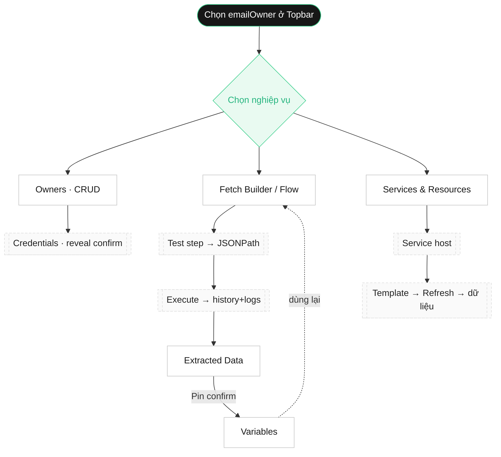

# API Fetch Manager — SPEC_UI (Design System / Skill) · Bản hợp nhất

> **Tài liệu SKILL về giao diện — NGUỒN CHÂN LÝ DUY NHẤT cho UI.** Mọi agent code UI PHẢI tuân thủ 100%. Đây là bản đã **hợp nhất** SPEC_UI gốc + addendum v1.2→v1.6 (các file addendum riêng lẻ đã bỏ, xem git history nếu cần).
>
> **Version:** 2.0 (consolidated) · **Nền tảng:** CSS variables thuần. Khi mâu thuẫn, tài liệu này là chuẩn cho UI. **Thiết kế visual chuẩn:** `stitch_prompt_execution_system/*/code.html` (dark emerald-on-dark).

---

## 0. Nguyên tắc bất biến (Golden Rules)
1. **Responsive** desktop + mobile, thống nhất toàn hệ thống, cùng 1 bộ component.
2. **2 theme** sáng/tối. Mọi màu qua CSS variable, không hardcode.
3. **Font mảnh 300–400**, spacing scale 4px, giao diện dày đặc.
4. **KHÔNG dùng `alert/confirm/prompt` browser.** Mọi thông báo qua modal (`ui.notify`/`ui.confirm`).
5. Mọi form/modal **tự detect chiều cao/rộng → tự scrollbar** (`max-height:90vh; overflow:auto`).
6. Modal **có nút ✕**; **click ngoài KHÔNG đóng**; ESC đóng; trap focus.
7. Mọi **button có icon + tooltip** mô tả chức năng + kết quả.
8. **Chức năng quan trọng** (xóa, execute, reveal, import ghi đè, rotate, xóa cron) phải có **confirm modal**.
9. **[v1.2] Tooltip tự flip/clamp trong viewport** (render bởi `lib/tooltip.ts`, `position:fixed`); KHÔNG dùng pseudo `::after`.
10. **[v1.4] Mọi danh sách** (table/card) BẮT BUỘC có **filter · sort · export JSON/CSV · export PDF** — dùng chung component `DataList`.
11. **[v1.6] Docs dịch vụ hiển thị KHÔNG che UI** đang thao tác (side-panel/split-pane, không modal full-screen).

---

## 1. Design Tokens
Biến CSS trong `frontend/src/styles/tokens.css`. Palette dark theo Stitch (`code.html` tailwind.config): bg `#0e1510` · surface `#1a211c` · elevated `#242c27` · border `#3d4a41` · primary `#60eca8` · primary-container `#3ecf8e` · on-primary `#003822` · text `#dde4dd` · text-muted `#bbcabe`. Font Inter (UI) + JetBrains Mono (code). Radius technical/square-ish (2/4/8px). Spacing 4px scale. Row 32px, topbar 48px, sidebar 220px.

---

## 2. Responsive Breakpoints
`--bp-sm 480 · --bp-md 768 · --bp-lg 1024 · --bp-xl 1280`. <768px: sidebar → drawer, bảng → card list, modal full-width. ≥768px: 2 cột. ≥1024px: sidebar cố định, content max-width 1200 căn giữa.

---

## 3. Layout khung
Topbar 48px sticky (logo · owner selector search · self-test · inspect · theme). Sidebar 220px (thu gọn được, có brand header + card "System Healthy" đáy). Content scroll riêng. Status bar đáy (git commit · build time · env · owner active). Sidebar đúng thứ tự: **Owners → Credentials → Fetch Builder → Services & Resources → History & Logs → Extracted Data → Variables → Issues → Self-Test**.

---

## 4. Component Specs
- **4.1 Button** `.btn` h30px, icon + `data-tooltip` bắt buộc; biến thể primary/danger/ghost/icon; disabled opacity .5; spinner loading.
- **4.2 Modal** overlay + `.modal` (min(560px,100%), max-height 90vh). Head (title+✕) · body overflow auto · foot. Click overlay KHÔNG đóng; ESC đóng; trap focus.
- **4.3 NotificationModal** thay alert (success/error/info/warning).
- **4.4 ConfirmModal** cho chức năng quan trọng.
- **4.5 Tooltip** global auto-flip/clamp (v1.2 §1).
- **4.6 Form controls** label trên, `--fw-thin`, focus outline 2px primary. `.field--center` cho modal token (v1.2 §6).
- **4.7 Table/Card list** desktop row 32px; <768 → card. Giá trị nhạy cảm masked + 👁 confirm reveal. Rule `.kv-row` giãn cách label↔value (v1.2 §2).
- **4.8 Scrollbar** mảnh 6px đồng bộ theme.

---

## 5. Theme toggle
`data-theme` trên `<html>`, lưu localStorage `API_FETCH_MANAGER_theme`. Mặc định **dark** (emerald-on-dark theo Stitch). Toggle ở Topbar (icon + tooltip).

---

## 6. Inspect Element Mode
Toggle 🎯 + **hotkey toàn cục Ctrl+Shift+J** (override env `VITE_API_FETCH_MANAGER_INSPECT_HOTKEY`), hoạt động mọi form/modal. Hover highlight, chọn nhiều element (lưu selector + outerHTML + rect + **text**). Thanh công cụ: **Tạo issue (n) · Tạm ngưng · Thoát** (ESC = thoát); khi tạm ngưng/mở form issue → nhả con trỏ (`inspect-paused`). Chạy được trên modal. Panel element: row #/selector/text. Export/copy Markdown kèm text. (v1.2 §5)

---

## 7. Icon set
Lucide (hoặc Material Symbols theo Stitch), stroke 1.5, nhất quán, mỗi button 1 icon rõ nghĩa.

---

## 8. Accessibility & States
Focus ring 2px primary. Đủ 8 trạng thái: default/hover/focus/active/disabled/loading/error/success. `aria-modal`, `aria-label`. Contrast WCAG AA cả 2 theme.

---

## 9. Fetch Flow, Variables & Placeholder Engine UI
- **9.1 Fetch Builder Flow (multi-step):** 2 pane (trái steps list kéo-thả, phải step editor). Step editor: Method · URL · Headers rows · Body textarea mono + **Beautify** · Extract block (field + JSONPath + pin var). Placeholder highlight + autocomplete `{{ctx/var/input}}`. **Test API theo step** (params runtime JSON → response format đẹp → chọn JSONPath, Copy curl). Tạo từ mẫu / Lưu thành mẫu (flow-presets).
- **9.2 Inputs config** source runtime/store/context, mỗi row có tooltip.
- **9.3 Execute Modal** hỏi input runtime; stepper dọc (pending→running→success/error); step lỗi xem log.
- **9.4 Extracted Data** DataList: Field · Value (masked nếu nhạy cảm) · Template nguồn · Thời điểm. CRUD đầy đủ + 📌 Pin thành biến (confirm).
- **9.5 Variables** 2 tab Global/Owner. CRUD qua modal. Copy `{{var.key}}`.
- **9.6 Placeholder Engine editor** autocomplete `{{`, transform pipe builder, advanced JS editor (badge sandbox: cấm network/fs, timeout 200ms, nút Test).

---

## 10. Combobox / KeyPicker (v1.2 §3§4)
- **Combobox** chung (nhập tự do HOẶC chọn danh mục, nút "Lưu vào danh mục"). Danh mục dùng chung workspace (`/api/catalogs?field=`). Dùng cho Tên flow / Service / Business.
- **KeyPicker** chọn credential của owner → chèn `{{key}}`. **Khi key trùng: liệt kê từng credId (label + masked + credId), chèn ref theo credId** (khớp §12 credId). Kèm advanced JS + nút xem resolved (`/api/engine/resolve`).

---

## 11. [v1.3] Lưu đồ owner-centric + UI Test suite
`emailOwner` là context toàn cục chọn ở Topbar; mọi trang đọc `currentOwnerId`. Đổi owner → mọi trang cập nhật ngay. Trang chưa chọn owner → empty state CTA "Chọn owner".

**UI Test suite (chạy sau mỗi thay đổi):** TC-1 owner context · TC-2 Owner+Credentials · TC-3 Fetch Builder→Extract→Execute · TC-4 Extracted Data & Variables · TC-5 Services động · TC-6 design/theme · TC-7 owner search+status bar · TC-8 DataList · TC-9 service tabs+item-level · TC-10 Self-Test · TC-11 Docs viewer.

---

## 12. [v1.4] Owner search · Status bar · DataList · Service tabs
- **Owner selector** = combobox có ô search theo email (fuzzy), hiện email + badge số credential.
- **Danh sách Owner** mỗi dòng 4 action: Active lên Topbar · Tạo Fetch Builder · Xem credentials · Đi tới dịch vụ.
- **Status bar** đáy: git commit (link) · build time · env · owner active. Nguồn `API_FETCH_MANAGER_BUILD_SHA`/`BUILD_TIME` + `GET /api/meta`.
- **DataList** (RULE §0.10): filter (cột + full-text) · sort đa cột · export JSON/CSV/PDF (PDF giữ theme + tiêu đề + thời điểm + owner). Áp cho mọi danh sách.
- **Services & Resources** mỗi dịch vụ = 1 tab (động từ `serviceCatalog`); item-level: "Tạo Fetch Builder từ item" + "Lấy var" + vd cron "Gọi xóa theo id" (confirm).

---

## 13. [v1.5] Self-Test UI Mode
Toggle 🧪 Topbar → chạy trên owner sandbox + dữ liệu giả (KHÔNG chạm dữ liệu thật). Runner mỗi màn: auto-fill fixture → auto-click → capture (giá trị + text element) → assert → ghi log scope `self-test` (credential masked). Panel kết quả (DataList): ✓/✗ + text element + diff kỳ vọng/thực tế. **Mọi tính năng fetch bắt buộc có output kiểm chứng:** case Save Fetch Flow show el→curl→placeholder resolved→url thực tế không còn `{{...}}`. API: `POST /api/selftest/run`, `GET /api/selftest/results`.

---

## 14. [v1.6] Docs viewer dịch vụ
Side-panel/drawer trượt phải (resizable, ghim), KHÔNG che UI (RULE §0.11). Render markdown từ `docs/services/<host>.md` + ô search + mục lục anchor + link external. Trong builder: nút 📖 Docs mở đúng service; mỗi curl mẫu có nút "Dùng mẫu này" → parse-curl vào builder. Agent phải soạn đủ 6 file service (github/cloudflare/dpdns/tailscale/supabase/cron-job) với curl + tác dụng + response mẫu + link.

---

## 15. Checklist tuân thủ UI (tự kiểm trước khi bàn giao)
- [ ] Responsive cùng 1 hệ component; 2 theme qua CSS variable, 0 hardcode; font 300–400, spacing 4px.
- [ ] Không còn alert/confirm/prompt; modal có ✕ + click ngoài không đóng + tự scrollbar.
- [ ] Mọi button icon+tooltip; tooltip không cắt chữ ở mép.
- [ ] Chức năng quan trọng có confirm; credential masked, reveal qua confirm.
- [ ] Mọi danh sách dùng DataList (filter/sort/export JSON/CSV/PDF).
- [ ] Owner search theo email; đổi owner → mọi trang cập nhật; danh sách owner có 4 action.
- [ ] Status bar: commit + build time + env + owner.
- [ ] Fetch Builder: steps kéo-thả, highlight+autocomplete, KeyPicker theo credId, Test API + Copy curl, tạo/lưu mẫu.
- [ ] Services: mỗi dịch vụ 1 tab; item tạo builder + lấy var; xóa cron theo id có confirm.
- [ ] Docs viewer cạnh builder KHÔNG che UI; "Dùng mẫu" nạp curl.
- [ ] Self-Test: tự fill/click/assert; panel ✓/✗ + text + diff; case fetch có output.
- [ ] Inspect: hotkey Ctrl+Shift+J mọi nơi, chọn nhiều element, tạo issue, export Markdown.
